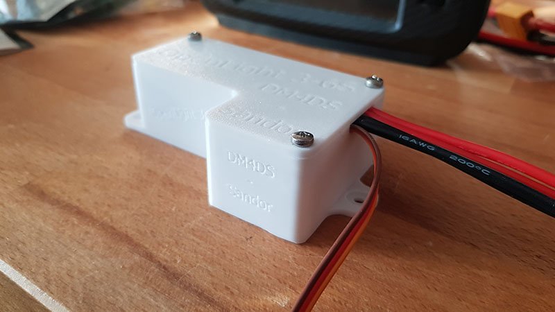
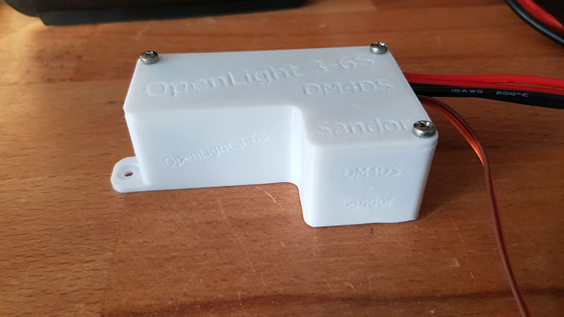
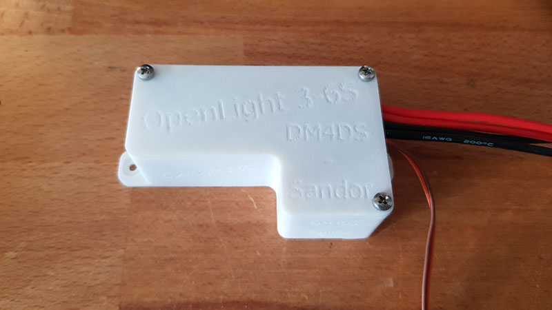

# OpenLight
OpenLight is an OpenSource alternative to the copyrighted UniLight.
So feel free to mod / share / whatever you like.

#update 20.nov.2013:
Now OpenLight supports WS2812 programmable LEDs!
Thanks to AdaFruit for the library.
_________________________________________
If you have questions, please first look into the code. Most lines are commented.
If you still have questions, feal free to ask!

What to do:
- Update the parts list
- Schematics but it should be fine while it is commented in the INO file already
- Update the 3D files for different usecases
- look over everything and update (partly done especially for high LED number WS2812 strips/plates)
- no idea
- something

Done:
- implement WS2812 programmable LED code. What a fun to play with them...
- optimized for WS2812 high number strips or plates! USE the RND v2 version and you will see it in the code

One of my non-ws2812 actuall setups:
- Arduino Micro 5V ( https://amzn.to/3rs5dHM )
- StepUp for my 33V LEDs from 3-6S usage ( https://amzn.to/3PStbVL - 250W ) (https://amzn.to/3Rz43oo -30W )
- MosFET Board ( https://amzn.to/3PUwV9A ) - to handle the watts and switch straight from the arduino output!
- XT60 input for the 3-6S power ( https://amzn.to/3ZEPVfl )
- XT30 ( https://amzn.to/465O8m1 ) output to the LED (30W - 33V 18x26mm ion my case but have not found a EU-Link :( )
- 30W are bright!

The LEDs are getting fast/really hot, if you turn them on for too long. For a "blink" they don´t need to stay on for 250ms!
Mine are only 10ms on, that is enough to light them up and immideatly cool the down during wait for the next 10ms blink!
So I don´t need extra heatsinks under the 30W LEDs!

WS2812 setup:
- Arduino Micro 5V ( https://amzn.to/3rs5dHM )
- WS2812D IP67 LEDs ( https://amzn.to/3GaOLPT )
- to provide the "power" for the LEDs I use a stepDown to 5V - so my RX is not perma under load. ( https://amzn.to/3syo58B )
- as power connectors as always XT30/60
- the WS2812 had it´s own connector, maybe you need one for yours, so keep an eye on that

Have fun testing/modifying. Maybe you are able to post a video and link it to me or in the RC-Network Thread:
https://www.rc-network.de/threads/openlight-unilight-in-eigenbau.11972603/

All the best - stay safe - stay healthy
DM4DS - Sandor

______________________________________________________
I do have a cold, voice is coming back slowly and my Samsung S8+ is not "fast enough" to capture the 10ms blink of the LED with its immens brightnes...
Try do make a better video, mabye as project video on youtube, so follow on @youtube, you don´t miss it.

https://github.com/DM4DS/OpenLight/assets/36482423/3efae417-0a31-46c0-ac7d-e3dbd7b221c7

https://github.com/DM4DS/OpenLight/assets/36482423/7b8483a2-6c0d-4a4b-bf42-8d83a4e4f952

https://github.com/DM4DS/OpenLight/assets/36482423/4f2229dc-e15b-4664-8377-f4358281effc

 

