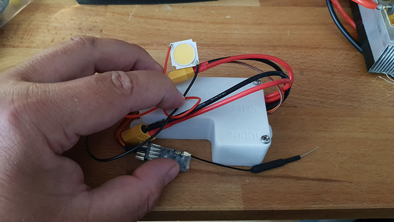

# OpenLight
OpenLight is an OpenSource alternative to the copyrighted UniLight.
So feel free to mod / share / whatever you like.

If you have questions, please first look into the code. Most lines are commented.
If you still have questions, feal free to ask!

What to do:
- Update the parts list
- Update the 3D files for different usecases
- look over everything and update
- no idea
- something

My actuall setup is:
- Arduino Micro 5V ( https://amzn.to/3rs5dHM )
- StepUp for my 33V LEDs from 3-6S usage ( https://amzn.to/3PStbVL - 250W ) (https://amzn.to/3Rz43oo -30W )
- MosFET Board ( https://amzn.to/3PUwV9A ) - to handle the watts and switch straight from the arduino output!
- XT60 input for the 3-6S power ( https://amzn.to/3ZEPVfl )
- XT30 ( https://amzn.to/465O8m1 ) output to the LED (30W - 33V 18x26mm ion my case but have not found a EU-Link :( )
- 30W are bright!

The LEDs are getting fast/really hot, if you turn them on for too long. For a "blink" they don´t need to stay on for 250ms!
Mine are only 10ms on, that is enough to light them up and immideatly cool the down during wait for the next 10ms blink!
So I don´t need extra heatsinks under the 30W LEDs!

Try and test with your setup.

All the best
DM4DS - Sandor

